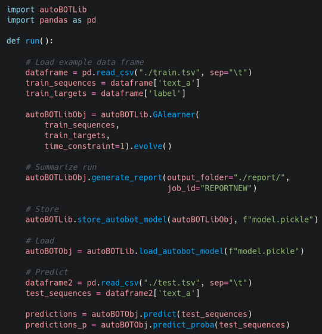

# autoBOT - an AutoML for neuro-symbolic text classification
Welcome to *autoBOT*'s documentation and source pages. Here, you can find simple examples to get you started,
but also delve deeper into autoBOT's capabilities. To explore autoBOT's functionality, start with the [TUTORIAL](https://skblaz.github.io/autobot/).

 
<pre>
MMMMMMMMMMMMMMMMMMMMMMMMMMMMMMMMMMMMMMMMMMMMMMMMMMMMMMMMMMMMMMMMMMMMMM
MMMMMMMMMMMMMMMMMMMMMMMMMMMMMMMMMMMMMMMMMMMMMMMMMMMMMMMMMMMMMMMMMMMWWM
WWMMMMMMMMMMMMMMMMMMMMMMMMMMMMMMMMMMMMMMMMMMMMMMMMMMMMMMMMMMMMMMMMWWWM
xokKNMMMMMMMMMMMMMMMMMMMMMMMMMMMMMMMMMMMMMMMMMMMMMMMMMMMMMWWMMMMMMMMMM
l'';cdOKNMMMMMMMMMMMMMMMMMMMMMMMMMMMMMMMMMMMMMMMMMMMMMMMMWNNMMMMMMMMMM
d'.''',;ldOXWMMMMMMMMMMMMMMMMMMMMMMMMMMMMMMMMMMMMMMMMMMMMMMMMMMMMMMMMM
x'...''''',c0MMMMMMMMMMMMMMMMMMMMMMMMMMMMMMWWMMMWXXMMMMMMMWWMMMMMMMMMM
k,....''''';kWMMMMMMMMMMMMMMMMMMMMMMMWNXWMN00NMMXk0NMMMMWXKNMMMMMMMMMM
0;......''';kWNK00000OOOOOOOOOOOKNXK0xx0WN0kONMWX00NMMMMN00XMMMMMWNNMM
K:........';OWx;;;;;;;;;;:::::ccldxxxxk0NNXXNWMMMMMMMMMMMWNWMMMMMWNNMM
Xc.........;OWx,',,,,,;;;;;:::::ccoxkOxdkKkxk0NWMMMMMMMMMMMMMMMMMMMMMM
Nl.........,OWk,''',,,,,;;;;;::::lxkkkOOKNK0KXX00NMMMWWMMMMMMMMMMMMMMM
Wd.........,OWk,''''',,,,,;;;;;::oddllx0KKNMWKxoxKMMWKKWMMMMMMMMMMMMMM
Wx.........,OMXxc;''''',,,,,;;;;:okkk0NN0xx0NN0OKWMMNkONMMWXNMMMMMMMMM
MO'........,OMMWWKkoc,''',,,,,;;cddld0N00NXOkKNNWMMMWXKNMWKk0WMMMMMMMM
M0, .......,OWOkXWMMN0ko:,,,,,,,;cox0Kxcl0XkoxOXWMMMMMMMMWNXXWMMMMMMMM
MK;   .....,ONo.;dKWMMMWX0xl:,,,;oOKX0xddk00KNMMMMWWMMMMMMMMMMWNWMMMMM
MXc     ...'ONl...,lONMMMMMWXOddkOxxkKX0xooONMMMWKxkNMMMMMMMMN0OXMMMMM
MNl.      .'ONl.....'ckXWMMMMMMWWWNNNWWMWXXWMMMWKdcdXMMMMMMMMWNNWMMMMM
MWd.       'ONl........;dKWMMMMMMMMMMMMMMMMMMMMWKkx0WMMNKXMMMMMMMMMMMM
MMx.       'OWOoc;'......,oONMMMMMMMMMWWMW00NWMMMMMMMMW0dxKWMMMMMMMMMM
MMO.      .;0MMWWNX0kxoc:,',ckXWMMMMWKdlxKOllxKWMWWMMMWXKXNWMMMMMMMMMM
MM0,    .:xKWMNkdx0XWMMWNXKOxdkKWMWWXkkO0XNK00XWWOkNMMMMMMMMMMMMMMMMMM
MMX; 'cxKWN0x0WKc..';ldk0XWMMMWWWMMMMMMMMMMMMMMNk:lKMMN0kOKWMMMMMMMMMM
MMWOOXWN0d;. 'dNXo.  ....,:ldkKXWWXXKO0KXNMMMMMNOxd0WMWOcoKMMMMMMMMMMM
MMMMW0d;.     .:0Nx'.  .......';oxc,:oxl:OXOkOOXWMWWMMMN0KWMMMMMMMMMMM
MMMW0c.         'xXO,.  .........:ooloxxclkl,cxXWMN0KWMMMMMMMMMMMMMMMM
MMMMMNKxl,.      .cK0:.   .......:lc,.cxodOOkXWMMNkccdKWMMMMMMMMMMMMMM
MMMMMMMMMNKxl;.    ,k0l.    .....'okdodlcxKWWWMMMWNXK00NMMMMMMMMMMMMMM
MMMMMMMMMMMMMWKkl;. .l0d.     ...:k0xclONWNkldONMMMMMMMMMMMMMMMMMMMMMM
MMMMMMMMMMMMMMMMMWKkl:lkx,.    ..:x0d:ckNNOdx0NWMMMMMMMMMMMMMMMMMMMMMM
MMMMMMMMMMMMMMMMMMMMMN0OXO:,,,;;o0K0kocdXNNWMMMMMMMMMMMMMMMMMMMMMMMMMM
</pre>



If you use this work, please cite:

```
@Article{Škrlj2021,
author={{\v{S}}krlj, Bla{\v{z}}
and Martinc, Matej
and Lavra{\v{c}}, Nada
and Pollak, Senja},
title={autoBOT: evolving neuro-symbolic representations for explainable low resource text classification},
journal={Machine Learning},
year={2021},
month={Apr},
day={14},
abstract={Learning from texts has been widely adopted throughout industry and science. While state-of-the-art neural language models have shown very promising results for text classification, they are expensive to (pre-)train, require large amounts of data and tuning of hundreds of millions or more parameters. This paper explores how automatically evolved text representations can serve as a basis for explainable, low-resource branch of models with competitive performance that are subject to automated hyperparameter tuning. We present autoBOT (automatic Bags-Of-Tokens), an autoML approach suitable for low resource learning scenarios, where both the hardware and the amount of data required for training are limited. The proposed approach consists of an evolutionary algorithm that jointly optimizes various sparse representations of a given text (including word, subword, POS tag, keyword-based, knowledge graph-based and relational features) and two types of document embeddings (non-sparse representations). The key idea of autoBOT is that, instead of evolving at the learner level, evolution is conducted at the representation level. The proposed method offers competitive classification performance on fourteen real-world classification tasks when compared against a competitive autoML approach that evolves ensemble models, as well as state-of-the-art neural language models such as BERT and RoBERTa. Moreover, the approach is explainable, as the importance of the parts of the input space is part of the final solution yielded by the proposed optimization procedure, offering potential for meta-transfer learning.},
issn={1573-0565},
doi={10.1007/s10994-021-05968-x},
url={https://doi.org/10.1007/s10994-021-05968-x}
}
```
